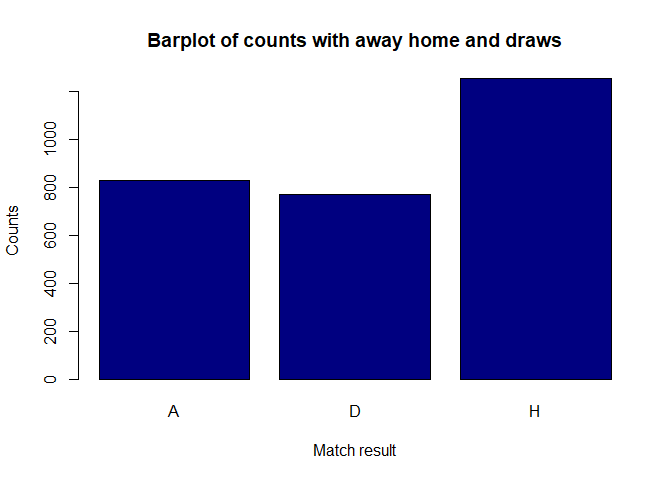

<!-- README.md is generated from README.Rmd. Please edit that file -->

# Football_Results_Predictions

The goal of Football_Results_Predictions is to classify football matches
in terms of Home win Away win or draw for matches in Polish Ekstraklasa,
the highest division in polish national football.

Data will be probably primarilly drawn from
<https://www.football-data.co.uk/poland.php>

It has the following structure

``` r
Data <- readr::read_csv("https://www.football-data.co.uk/new/POL.csv")
#> Rows: 2849 Columns: 19
#> -- Column specification --------------------------------------------------------
#> Delimiter: ","
#> chr   (7): Country, League, Season, Date, Home, Away, Res
#> dbl  (11): HG, AG, PH, PD, PA, MaxH, MaxD, MaxA, AvgH, AvgD, AvgA
#> time  (1): Time
#> 
#> i Use `spec()` to retrieve the full column specification for this data.
#> i Specify the column types or set `show_col_types = FALSE` to quiet this message.
summary(Data)
#>    Country             League             Season              Date          
#>  Length:2849        Length:2849        Length:2849        Length:2849       
#>  Class :character   Class :character   Class :character   Class :character  
#>  Mode  :character   Mode  :character   Mode  :character   Mode  :character  
#>                                                                             
#>                                                                             
#>                                                                             
#>                                                                             
#>      Time              Home               Away                 HG       
#>  Length:2849       Length:2849        Length:2849        Min.   :0.000  
#>  Class1:hms        Class :character   Class :character   1st Qu.:1.000  
#>  Class2:difftime   Mode  :character   Mode  :character   Median :1.000  
#>  Mode  :numeric                                          Mean   :1.476  
#>                                                          3rd Qu.:2.000  
#>                                                          Max.   :7.000  
#>                                                                         
#>        AG            Res                  PH               PD       
#>  Min.   :0.000   Length:2849        Min.   : 1.160   Min.   :2.800  
#>  1st Qu.:0.000   Class :character   1st Qu.: 1.900   1st Qu.:3.320  
#>  Median :1.000   Mode  :character   Median : 2.280   Median :3.460  
#>  Mean   :1.162                      Mean   : 2.497   Mean   :3.596  
#>  3rd Qu.:2.000                      3rd Qu.: 2.820   3rd Qu.:3.710  
#>  Max.   :6.000                      Max.   :12.810   Max.   :7.790  
#>                                     NA's   :1        NA's   :1      
#>        PA              MaxH             MaxD            MaxA       
#>  Min.   : 1.260   Min.   : 1.160   Min.   :2.920   Min.   : 1.300  
#>  1st Qu.: 2.690   1st Qu.: 1.960   1st Qu.:3.400   1st Qu.: 2.780  
#>  Median : 3.430   Median : 2.350   Median :3.510   Median : 3.550  
#>  Mean   : 3.895   Mean   : 2.577   Mean   :3.671   Mean   : 4.057  
#>  3rd Qu.: 4.480   3rd Qu.: 2.890   3rd Qu.:3.780   3rd Qu.: 4.600  
#>  Max.   :23.430   Max.   :13.440   Max.   :8.000   Max.   :23.430  
#>  NA's   :1                                                         
#>       AvgH             AvgD            AvgA       
#>  Min.   : 1.140   Min.   :2.760   Min.   : 1.250  
#>  1st Qu.: 1.870   1st Qu.:3.190   1st Qu.: 2.590  
#>  Median : 2.210   Median :3.300   Median : 3.240  
#>  Mean   : 2.393   Mean   :3.428   Mean   : 3.626  
#>  3rd Qu.: 2.700   3rd Qu.:3.510   3rd Qu.: 4.120  
#>  Max.   :11.260   Max.   :7.300   Max.   :18.640  
#> 
```

``` r
barplot(table(Data$Res), col = "navy", 
        main = "Barplot of counts with away home and draws",
        ylab = "Counts", xlab = "Match result")
```

<!-- -->
